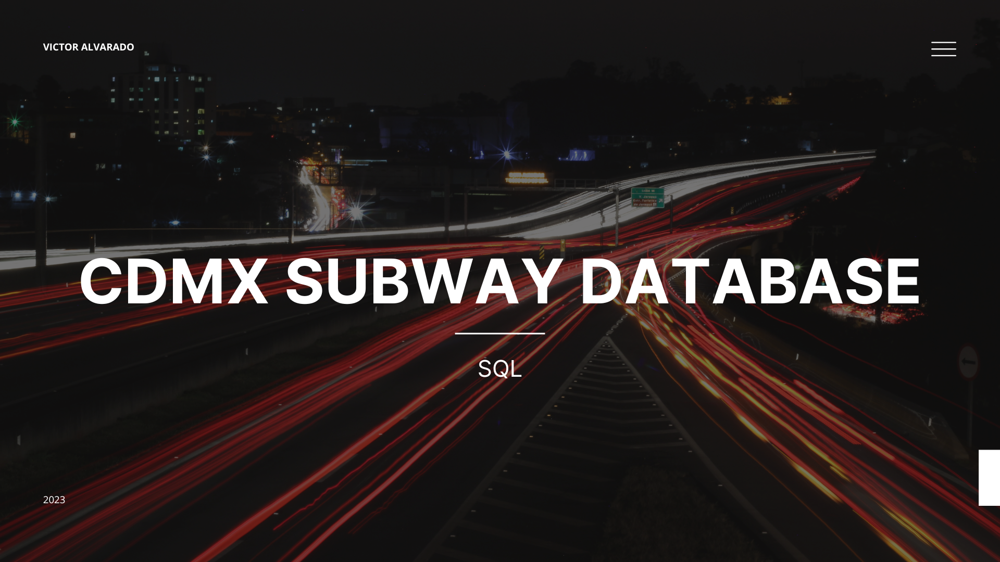

#  Hello, my name is Victor Alvarado 👋
### I´m a Software Engineer

My skill set includes proficiency in Python and its Django framework, as well as a strong knowledge in the design and development of APIs. Additionally, I have experience in the implementation and management of both relational and non-relational databases.

I have worked on projects ranging from logistics transportation management systems to social media platforms, which has allowed me to develop an understanding of project development.

Currently, I am continuously updating my skills as a software engineer and in the field of data through various courses.

## Technologies:
   
  

## Let´s get in touch on LinkedIn:

## Some projects:

<table style="width:100%">
<tr>
<td>

</td>
<td>

</td>
<td>

</td>
</tr>
<tr>
<td>

</td>
<td>

</td>
<td>

</td>
</tr>
<tr>

</tr>
</table>

## Contact:

 
